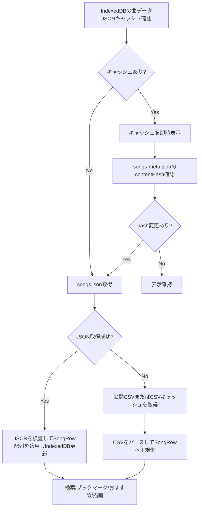
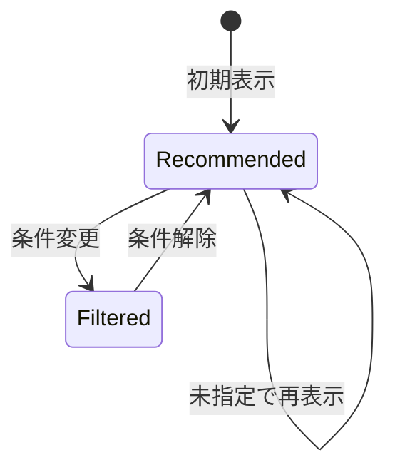
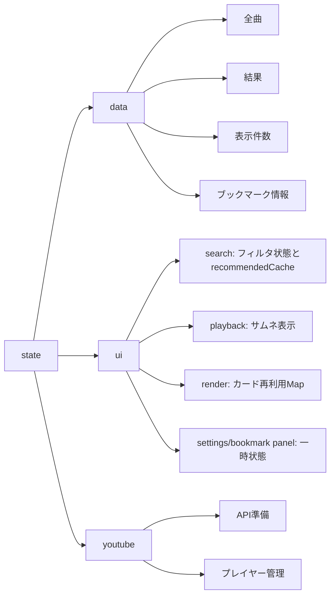

# 鐘輝かう 歌サーチ 設計書（概要）

## 目的
公開スプレッドシートの歌データを検索・絞り込みし、YouTube動画へアクセスしやすくする。

## 対象ユーザー
- 配信/歌みた/ショート/切り抜きを探したい視聴者
- PC/スマホの両方から利用するユーザー

## 全体構成
- 静的フロントエンドのみ（HTML/CSS/JS, ES Modules）
- データ取得：事前生成JSON（`data/songs.json` / `data/songs-meta.json`）を優先し、公開スプレッドシートのCSVは生成元とフォールバックに使う
- データ生成/公開：GitHub Actions でCSVからJSONを生成し、Pages artifact を deploy する
- 実行時の同梱外部ライブラリ依存：なし
- 埋め込み再生まわりでは YouTube Iframe API を動的に利用
- 開発時テスト：Node.js 標準 `node:test` と Playwright Chromium smoke を利用

## テスト方針（現状）
- 対象: 検索ロジック、日付フィルタ、ブックマーク検索、描画/再生/保存/サイドバーまわりの回帰
- 重点ケース: ブックマーク表示時のみ有効なドラッグ並び替えと、並び順の永続化、YouTube 継続再生の失敗復旧
- テストファイル:
  - `tests/bookmark-storage-schema.test.mjs`
  - `tests/bookmark-ui.test.mjs`
  - `tests/csv-parser.test.mjs`
  - `tests/data-loader.test.mjs`
  - `tests/dom-utils.test.mjs`
  - `tests/search-date.test.mjs`
  - `tests/format-filter.test.mjs`
  - `tests/playback-sequence.test.mjs`
  - `tests/playback-session-controller.test.mjs`
  - `tests/render-drag-reorder.test.mjs`
  - `tests/render-layout.test.mjs`
  - `tests/render-masonry-layout.test.mjs`
  - `tests/sidebar-ui.test.mjs`
  - `tests/storage-bookmark-limit.test.mjs`
  - `tests/ui-storage-compat.test.mjs`
  - `tests/ui-sync.test.mjs`
  - `tests/youtube-controller.test.mjs`
  - `tests/youtube-embed.test.mjs`
  - `tests/youtube-playback-start-attempt.test.mjs`
  - `tests/youtube-playback-state.test.mjs`
  - `tests/youtube-player-adapter.test.mjs`
  - `tests/youtube-shared-playback.test.mjs`
  - `tests/youtube-thumbnail.test.mjs`
  - `tests/youtube-unconfirmed-playback-start.test.mjs`
  - `tests/layout-anchor.test.mjs`
  - `tests/results-scroll.test.mjs`
  - `tests/e2e/youtube-smoke.spec.mjs`
  - `tests/songs-content-hash.test.mjs`
  - `tests/songs-data-source.test.mjs`
  - `tests/songs-json-cache.test.mjs`
  - `tests/songs-json.test.mjs`
- 実行コマンド:
  - `node --test tests/*.mjs`
  - `npm run test:e2e`

## 主要機能
- 検索（曲名/アーティスト名/読み、複数キーワード）
- 絞り込み（形態/リレー/ハモリ/日付範囲）
- ブックマーク（作成/名称変更/削除/曲の追加・削除/選択/表示中の曲順並び替え）
- おすすめ表示（条件未指定時）
- 段階表示（追加読み込み）
- サムネイル表示と埋め込み再生
- テーマ切替（ダーク/ライト）

## UI構成
- **サイドバー**：検索・絞り込み・設定
  - 検索入力
  - 日付選択（年/月/日セレクト、From/To）
  - 形態フィルタ（配信/オリ曲/歌みた/ショート/切り抜き。UI上はオリ曲/歌みたを1項目として扱う）
  - リレー/ハモリ
  - ブックマーク導線（専用パネルを開く）
  - 設定導線（専用パネルを開く）
- **サイドバー内設定パネル**：表示設定
  - 表示
    - サムネイル表示
    - ダークモード切替
- **サイドバー内ブックマークパネル**：ブックマーク一覧と曲追加
  - 一覧の選択/名称変更/削除
  - 曲カードの `+` 押下時は同パネル上で既存ブックマーク選択または新規作成して追加
  - JSON形式でのエクスポート/インポート。インポートは現在のブックマークを全置き換えする
- **メイン**：検索結果一覧（カード）
  - 曲名/アーティスト
  - 日付
  - タグ（形態/リレー/ハモリ）
  - ブックマーク操作（追加/選択中ブックマークから削除）
  - ブックマーク表示中のみドラッグハンドルを表示し、ハンドル操作でカード順を並び替え
  - YouTubeリンク

## データフロー
1. IndexedDB の曲データJSONキャッシュを確認する。
2. キャッシュがあれば即時表示し、バックグラウンドで `songs-meta.json` の `contentHash` を確認する。
3. キャッシュがない、または `contentHash` が変わっている場合は `songs.json` を取得し、schema と曲データを検証して保存する。
4. JSON取得に失敗した場合は、公開CSVまたはCSVキャッシュを取得し、`SongRow` に正規化する。
5. （ブックマーク選択中なら）ブックマーク内の曲集合を解決する。
6. 条件未指定ならおすすめ結果を解決し、通常時は検索条件を取得してフィルタする。
7. 結果一覧を描画し、通常検索/ブックマーク検索時のみ段階表示を有効化する。

## データモデル（概要）
`SongRow`
- date / dateKey / archiveId / archiveOrder / sourceIndex
- videoId / songKey / bookmarkSongKey / legacySongKey / format / videoOrientation / isRelay / isHarmony
- title / artist / titleYomi / artistYomi
- endSeconds
- titleNorm / artistNorm / titleYomiNorm / artistYomiNorm
- url

### 曲参照キーの役割分担
- `songKey`: `archiveId::archiveOrder` を使う内部参照キー。カード再利用、描画更新、既存の画面内処理で利用する。
- `bookmarkSongKey`: `videoId::archiveOrder` を優先するブックマーク保存用キー。`videoId` を抽出できない場合は `songKey` へフォールバックする。
- ブックマーク検索では `bookmarkSongKey` を優先して曲行へ解決し、旧ブックマークの `songKey` / `legacySongKey` / 数値 index も移行対象として読み取る。

## 検索・絞り込みロジック
- 検索語：正規化＋AND検索（スペース区切り）
- 形態：選択セットに含むか。`オリ曲` はUI上 `歌みた` と同じ項目で扱う
- リレー/ハモリ：チェック時のみ条件を追加
- 日付：From/To の範囲一致（部分入力は範囲に補正）

## おすすめ表示の方針
- 条件未指定時におすすめ表示
- おすすめは曲データを再読み込みするまで固定し、条件変更でおすすめ表示を離脱して戻っても同じ並びを再利用する

## おすすめの状態遷移

### 状態
- **Recommended**: おすすめ表示中（条件未指定）
- **Filtered**: フィルタ/検索によりおすすめ条件から外れた状態

### 条件判定（「未指定」の定義）
- キーワードが空（検索ボックスが空）
- 日付が未指定（From/To ともに年・月・日が未選択）
- 形態フィルタ4項目がすべてON（配信 / オリ曲/歌みた / ショート / 切り抜き）
- リレー/ハモリがOFF
- ブックマークが未選択

### 遷移ルール
- **Recommended → Filtered**
  - キーワード入力
  - 日付の指定（年/月/日いずれか）
  - 形態のチェックを外す
  - リレー/ハモリをON
- **Filtered → Recommended**
  - 上記の条件をすべて解除して「未指定」に戻したとき

### 並びの扱い
- **Recommended 状態は同条件なら固定**
- **条件を変えて元に戻しても並びは維持**
- **曲データ再読み込み時のみおすすめが再抽出される**

### 表示の扱い
- Recommended では「おすすめを表示中」の状態テキストを表示
- Filtered では「n件がヒット」の状態テキストを表示
- ブックマーク選択中は「ブックマーク名 + 件数」を状態テキストに表示
- どちらの状態でも検索条件の変更は即時に反映される

- 図中の「条件変更」は、キーワード入力・日付指定・形態の絞り込み・リレー/ハモリONをまとめた表記。
- 図中の「条件解除」は、上記の条件をすべて外して未指定に戻すことを指す。
- 曲データ再読み込み時はおすすめキャッシュを破棄し、おすすめ一覧を再抽出する。

## おすすめ抽出の具体ロジック

### 対象母集団
- JSONまたはCSVから読み込んだ全曲データ（`data.allSongsRaw`）
- ブックマーク未選択かつ、形態/リレー/ハモリ/日付/キーワードの条件がすべて未指定のときのみ「おすすめモード」

### 除外条件
- 形態/リレー/ハモリ/日付/キーワードのいずれかが未指定条件から外れた場合は、おすすめモード自体を解除
- おすすめ候補の集計対象は `配信` / `歌みた`（`オリ曲` を含む） / `ショート` のみとし、`切り抜き` は集計対象外
- 通常は同一曲が一定回数以上歌われている場合のみ、おすすめ候補に含める
- ただし `オリ曲` を含む曲は1回でもおすすめ候補に含める
- 同一曲・同一アーカイブの重複候補は、`archiveOrder` と `sourceIndex` を用いて代表行へ集約する

### シャッフルタイミング
- 曲データを再読み込みしたタイミングでおすすめを再抽出・再シャッフル
- 条件を変更しておすすめから離脱→条件を元に戻す場合は、同じおすすめ並びを維持

### キャッシュの扱い
- おすすめ一覧は `ui.search.recommendedCache` に保持
- 条件変更ではキャッシュを破棄しない
- 曲データ再読み込み時のみキャッシュを破棄

## 関連関数の責務一覧（おすすめ）
- `createSongsDataSource()`：生成済みJSON、JSONキャッシュ、meta hash、CSVフォールバックをまとめた曲データ取得の入口
- `createDataLoader()`：取得した曲データを状態へ反映し、検索更新をスケジュールする
- `applyLoadedSongs()`：曲データ読込後の初期化（おすすめキャッシュのリセット含む）
- `pickRecommended()`：おすすめ候補の抽出とシャッフル、キャッシュ利用の中心
- `scheduleSearch()`：検索/絞り込みの実行をデバウンスして呼び出す
- `search()`：条件取得→フィルタ→表示までの入口
- `updateDisplay()`：結果のカード表示と「おすすめ/ヒット件数」表示の切替
## 状態管理
`state`
- `data`：全曲/結果/表示件数/ブックマーク情報/選択中ブックマーク
- `ui`：検索/日付/再生/描画/設定パネル/ブックマークパネルなどの画面状態
- `youtube`：API準備/プレイヤー管理

## 永続化
ローカルストレージ保存：
- テーマ
- サムネ表示
- CSVキャッシュ（JSON取得失敗時のフォールバック用）
- 検索条件（キーワード・日付・形態など）
- ブックマーク情報（ブックマーク名・曲参照/順序・作成日時）
- ブックマーク保存 payload は `version` を持ち、旧参照形式は曲データ読み込み後に現行の `bookmarkSongKey` へ保存し直す
- エクスポートするJSONはブックマーク保存 payload と同じ構造にし、インポート時は同じ検証/移行を通してから全置き換えで保存する

IndexedDB保存：
- 曲データJSONキャッシュ
  - DB名は `knksongs`、object store は `songsJsonCache`
  - `songs-meta.json` の `contentHash` と突き合わせ、変化がなければ `songs.json` の再取得を避ける
  - 旧localStorageの曲データJSONキャッシュは読み込み時に移行し、移行成功後に旧キャッシュを削除する

## YouTube埋め込み
- `youtube.com` の標準埋め込みを使用
- サムネイル表示ON時にクリックで埋め込み再生し、`×` でサムネイルへ戻す
- 曲データの `endSeconds` がある場合は埋め込み再生の終了秒数として反映する
- 手動再生でカード上端がヘッダー下に隠れる場合は、再生開始後に見える位置まで補正スクロールする
- 曲名リンクは元の `row.url` を別タブで開く
- 縦動画はサムネイル時は横レイアウトのまま表示し、埋め込み再生時のみ縦向き表示へ切り替える

## アクセシビリティ
- サイドバーを `dialog` として扱う
- フォーカストラップとフォーカス復帰
- `aria-label` / `aria-modal` / `aria-hidden`

## パフォーマンス
- 曲データJSONをIndexedDBにキャッシュし、初期表示に利用する
- `songs-meta.json` の content hash で鮮度を確認し、大きい `songs.json` の取得頻度を抑える
- JSON取得に失敗した場合に備え、CSVもフォールバック用にキャッシュする
- 段階表示（追加読み込み）
  - 通常検索・ブックマーク検索ともに `RESULT_DISPLAY_BATCH_SIZE` 単位で追加表示
- サムネ遅延読み込み（IntersectionObserver）

## 制約・注意点
- iOSでは埋め込み再生に制約あり
- Safari等でCSSキャッシュが残ることがあるため更新時はバスター推奨
- `index.html` の `styles.css?v=...` と `app/bootstrap.mjs?v=...` は同じ値で運用する
  - UI/JS変更ごとには上げず、公開反映や配布反映の直前にまとめて値を上げる
- `app/bootstrap.mjs` から読む ES Modules を更新した場合は、対応する import の `?v=...` も上げる
  - 変更途中は既存値へ揃え、公開時に全体を同じ値へ切り替える
- `songs.json` / `songs-meta.json` の内容更新だけでは cache buster を上げず、`contentHash` による鮮度確認で反映する
- 日付入力はセレクト方式（ブラウザ互換性優先）
