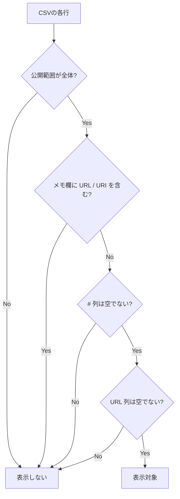

# 鐘輝かう 歌サーチ

公開URL: [https://an-oa.github.io/knksongs/](https://an-oa.github.io/knksongs/)

- 公開スプレッドシート由来の歌データを、曲名・アーティスト名(読み含む)で検索できるシンプルなWebサイトです。
- PC / スマホ両対応です。本サイト運営者のサーバへ個人情報を送信したり、独自の解析用トラッキングを行いません(設定保持のためにローカルストレージを使用します)。
- 通常の曲データ表示では GitHub Pages 上の生成済みJSONを取得します。JSON生成やフォールバック時には Google(スプレッドシートのCSV取得)、YouTube表示では youtube-nocookie.com やサムネイル配信元などへの通信が発生します。

---

## 主な機能

- 曲名 / アーティスト名で検索できます。
  - ひらがな/カタカナ等の読みでも検索できます。
  - 複数キーワード(スペース区切り)に対応します(全角スペースも可)。
- 絞り込みができます。
  - 配信 / オリ曲/歌みた / ショート / 切り抜き。
  - UI上では `オリ曲` を `歌みた` と同じ項目(「オリ曲/歌みた」)で扱います。
  - リレー / ハモリ。
  - 条件はサイドバー(検索メニュー)から操作できます。
- YouTubeへのリンクがあります。
  - 一覧の曲名リンクから該当動画へ遷移できます。
  - サムネイル表示をONにした場合、サムネイルをクリックしてページ内で埋め込み再生できます(×で閉じてサムネに戻ります)。
  - 埋め込み再生は `youtube-nocookie.com` の Privacy Enhanced Mode 埋め込みを使用します(曲名リンクは通常の `youtube.com` / `youtu.be` を開きます)。
    - CSVの終了時刻がある曲は、その時刻を埋め込み再生の終了位置として使います。
    - 一部のモバイル環境では、再生開始時刻が反映されない場合があります(端末/ブラウザ/YouTube側の挙動差によります)。
- 段階表示(追加読み込み)に対応します。
  - 検索結果/ブックマーク結果ともに、最初に一定件数を表示し、画面下の「つづきを表示」で追加表示します(負荷対策)。
- ブックマーク機能があります。
  - ブックマークを作成し、名称変更/削除できます。
  - 各曲を追加/削除できます。
  - 曲の追加先ブックマーク選択や新規作成は、サイドバー内のブックマークパネルで行います。
  - ブックマークを選択すると、その中で通常の検索/絞り込みができます。
  - ブックマーク表示中は、各カードのドラッグハンドルで曲順を並び替えできます（通常表示/おすすめ表示ではハンドルは表示されません）。
  - 並び替えた順序はブックマーク情報として保存され、次回表示時にも維持されます。
  - ブックマークパネルからJSON形式でエクスポート/インポートできます。
    - インポートは現在のブックマークを全置き換えします。
  - ブックマーク保存用の曲参照は `videoId::##` を優先し、既存データの `archiveId::##` は読み込み時に段階移行します。
  - 一方で画面内部のカード識別や描画再利用には、従来どおり `archiveId::##` ベースの `songKey` を使い続けます。
  - 上限は「ブックマーク数: 最大20件」「1ブックマークあたり: 最大120曲」「ブックマーク名: 最大64文字」です。
- 初期表示(おすすめ)があります。
  - 通常表示で検索条件が未指定のときは、一定回数以上歌われた曲からおすすめ表示します。
  - ただしオリ曲は、1回(1動画)でもおすすめ候補に含みます。
  - おすすめ一覧は条件変更でおすすめ表示を離れて戻っても維持され、曲データの再読み込み時に再抽出されます。
- 表示テーマを切り替えられます。
  - ダークモード切替に対応します(設定はブラウザに保存されます)。
- 設定パネルで表示設定を切り替えられます。
  - 表示: サムネイル表示 / ダークモード

---

## 表示対象の条件(重要)

このツールは、スプレッドシート(CSV)から取り込んだ全行を表示するわけではありません。次の条件を満たす行のみ表示対象になります。

1. 公開範囲列の値が「全体」であること。
2. 非公開に配慮し、メモ欄(コメント等)に `URL` / `URI` を含む行は表示しないこと。
3. `#` 列(行ID列)が空でないこと。
4. `URL` 列が空でないこと。

いずれかに該当しない行は一覧に表示されません。

---

## 使い方

1. サイドバーの検索条件で、必要な絞り込みを設定します。
2. 検索ボックスに曲名 / アーティスト名(読みでも可)を入力します。
3. 結果一覧が更新されます。
4. 各行の曲名リンクで動画を開けます。
   - サムネイル表示をONにしている場合は、サムネクリックでページ内再生もできます。

---

## データソース(開発者向けメモ)

- 通常の起動時は、事前生成された `data/songs.json` と `data/songs-meta.json` を優先して読み込みます。
- `songs-meta.json` の `contentHash` で手元のJSONキャッシュが最新かを確認し、変化がなければ大きい `songs.json` の再取得を避けます。
- 公開スプレッドシートのCSVは、事前生成JSONの元データかつJSON取得失敗時のフォールバックとして参照します(`app/config.mjs` の `PUBLIC_CSV_URL` で指定します)。
- `.github/workflows/update-songs-json-and-deploy.yml` は GitHub Actions 上で `npm run build:songs-json` を実行し、`data/songs.json` / `data/songs-meta.json` を更新して Pages へ deploy します。
- フロントエンドのみで動作します(静的ホスティング想定)。
- 配布物はHTML/CSS/JavaScriptのみで、実行時にnpm等の同梱依存はありません。
- サムネイル表示/埋め込み再生まわりでは YouTube Iframe API を動的に利用します。
- 開発時テストは Node.js 標準の `node:test` を利用します。
- ブラウザ回帰確認として Playwright による Chromium スモークテストを用意しています。

## テスト(開発者向け)

- 現在は以下のテストを用意しています。
  - ブックマーク保存スキーマ/移行のテスト (`tests/bookmark-storage-schema.test.mjs`)
  - ブックマークUIのテスト (`tests/bookmark-ui.test.mjs`)
  - CSVパースのテスト (`tests/csv-parser.test.mjs`)
  - 初期データ読み込み後の状態反映テスト (`tests/data-loader.test.mjs`)
  - DOM補助関数のテスト (`tests/dom-utils.test.mjs`)
  - 検索/日付フィルタ/ブックマーク検索のロジック (`tests/search-date.test.mjs`)
  - フォーマット表示ラベルのテスト (`tests/format-filter.test.mjs`)
  - 描画/レイアウトまわりの回帰テスト (`tests/render-layout.test.mjs`)
  - ブックマーク時のドラッグ並び替えテスト (`tests/render-drag-reorder.test.mjs`)
  - masonryレイアウト計算のテスト (`tests/render-masonry-layout.test.mjs`)
  - レイアウト補正待機のテスト (`tests/layout-anchor.test.mjs`)
  - 結果一覧スクロール制御のテスト (`tests/results-scroll.test.mjs`)
  - サイドバーUIのテスト (`tests/sidebar-ui.test.mjs`)
  - 曲データJSONのcontent hash算出テスト (`tests/songs-content-hash.test.mjs`)
  - 曲データソースのJSON優先読み込み/CSVフォールバック/キャッシュ更新テスト (`tests/songs-data-source.test.mjs`)
  - 曲データJSONキャッシュのIndexedDB/旧localStorage移行テスト (`tests/songs-json-cache.test.mjs`)
  - 曲データJSONスキーマのテスト (`tests/songs-json.test.mjs`)
  - ストレージ(ブックマーク上限/リネーム)の単体テスト (`tests/storage-bookmark-limit.test.mjs`)
  - UI設定/ストレージ互換のテスト (`tests/ui-storage-compat.test.mjs`)
  - UI同期のテスト (`tests/ui-sync.test.mjs`)
  - YouTubeサムネイル/埋め込み再生まわりの統合テスト (`tests/youtube-controller.test.mjs`)
  - YouTube埋め込みURL/API loader のテスト (`tests/youtube-embed.test.mjs`)
  - YouTube playback state / start attempt / player adapter の単体テスト (`tests/youtube-playback-state.test.mjs`, `tests/youtube-playback-start-attempt.test.mjs`, `tests/youtube-player-adapter.test.mjs`)
  - YouTube shared playback / thumbnail helper / unconfirmed playback start の単体テスト (`tests/youtube-shared-playback.test.mjs`, `tests/youtube-thumbnail.test.mjs`, `tests/youtube-unconfirmed-playback-start.test.mjs`)
  - Chromium 上での YouTube 再生スモークテスト (`tests/e2e/youtube-smoke.spec.mjs`)
- 実行コマンド:
  - `node --test tests/*.mjs`
  - `npm run test:e2e`
- Playwright のスモークテストを初回実行する前に、以下を準備してください。
  - `npm install`
  - `npx playwright install chromium`
  - `python3` が PATH 上で利用できること
- Playwright のスモークテストでは、静的サイトはローカル配信し、CSV と YouTube Iframe API は mock / fixture に差し替えて回帰確認します。
- `npm run test:e2e` は Playwright 側で `python3 -m http.server 4173 --bind 127.0.0.1` を起動して静的サイトを配信します。
- 現時点の Playwright 対象は Chromium です。iOS Safari は別途、実機または手動スモーク確認を想定します。

---

## 設定の保存について

このツールはサーバへ設定を送信しません。ただし、使い勝手のため以下をブラウザのローカルストレージまたは IndexedDB に保存します。

- テーマ(ダーク/ライト)。
- サムネイル表示ON/OFF。
- 検索状態(検索語・絞り込み条件・日付条件)。
- ブックマーク情報(ブックマーク名・曲の対応/順序・作成日時)。
  - 保存形式は version 付き payload で管理し、旧形式は読み込み後に現行形式へ保存し直します。
- 曲データJSONのキャッシュ(IndexedDB。旧localStorageキャッシュは読み込み時に移行します)。
- CSVのキャッシュ(JSON取得失敗時のフォールバックで前回のデータを表示するため)。
- テーマはローカルストレージを優先し、未設定時のみOSの配色設定に従います。

ブラウザのデータ削除を行うと、これらの保存内容はリセットされます。

---

## 免責事項・権利について

- 本ツールはファンによる非公式プロジェクトであり、鐘輝かう様ご本人および所属団体とは関係ありません。
- 本ツール内で表示される名称・画像・動画等の権利は各権利者に帰属します。
- 権利者様からの修正・削除のご要望があれば、Issue等でご連絡ください。速やかに対応します。
