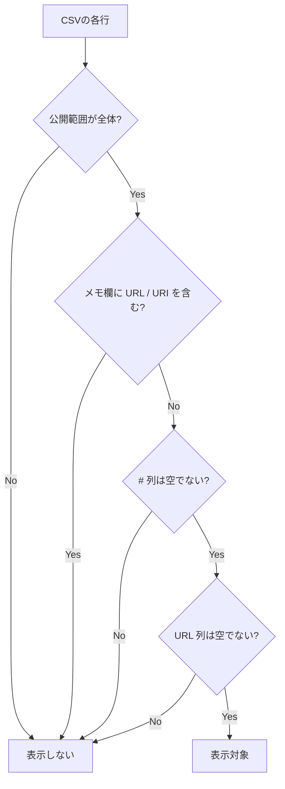

# かねきかう 歌サーチ(鐘輝かう 歌リスト検索ツール)

公開URL: [https://an-oa.github.io/knksongs/](https://an-oa.github.io/knksongs/)

- 公開スプレッドシート由来の歌データを、曲名・アーティスト名(読み含む)で検索できるシンプルなWebサイトです。
- PC / スマホ両対応です。本サイト運営者のサーバへ個人情報を送信したり、独自の解析用トラッキングを行いません(設定保持のためにローカルストレージを使用します)。
- データ取得や表示のために Google(スプレッドシートのCSV取得)や YouTube(youtube-nocookie.com、サムネイル配信元など)への通信は発生します。

---

## 主な機能

- 曲名 / アーティスト名で検索できます。
  - ひらがな/カタカナ等の読みでも検索できます。
  - 複数キーワード(スペース区切り)に対応します(全角スペースも可)。
- 絞り込みができます。
  - 配信 / 歌みた / ショート / 切り抜き。
  - リレー / ハモリ。
  - 条件はサイドバー(検索メニュー)から操作できます。
- YouTubeへのリンクがあります。
  - 一覧の曲名リンクから該当動画へ遷移できます。
  - サムネイル表示をONにした場合、サムネイルをクリックしてページ内で埋め込み再生できます(×で閉じてサムネに戻ります)。
  - 埋め込み再生はプライバシー強化モードとして `youtube-nocookie.com` を使用します(曲名リンクは通常の `youtube.com` / `youtu.be` を開きます)。
    - 一部のモバイル環境では、再生開始時刻が反映されない場合があります(端末/ブラウザ/YouTube側の挙動差によります)。
- 段階表示(追加読み込み)に対応します。
  - 検索結果/ブックマーク結果ともに、最初に一定件数を表示し、画面下の「つづきを表示」で追加表示します(負荷対策)。
- ブックマーク機能があります。
  - ブックマークを作成し、名称変更できます。
  - 各曲を追加/削除できます。
  - 曲の追加先ブックマーク選択や新規作成は、サイドバー内のブックマークパネルで行います。
  - ブックマークを選択すると、その中で通常の検索/絞り込みができます。
  - ブックマーク表示中は、各カードのドラッグハンドルで曲順を並び替えできます（通常表示/おすすめ表示ではハンドルは表示されません）。
  - 並び替えた順序はブックマーク情報として保存され、次回表示時にも維持されます。
  - 上限は「ブックマーク数: 最大20件」「1ブックマークあたり: 最大120曲」です。
- 初期表示(おすすめ)があります。
  - 通常表示で検索条件が未指定のときは、一定回数以上歌われた曲からおすすめ表示します。
  - おすすめ一覧は条件変更でおすすめ表示を離れて戻っても維持され、CSVの再読み込み時に再抽出されます。
- 表示テーマを切り替えられます。
  - ダークモード切替に対応します(設定はブラウザに保存されます)。

---

## 表示対象の条件(重要)

このツールは、スプレッドシート(CSV)から取り込んだ全行を表示するわけではありません。次の条件を満たす行のみ表示対象になります。

1. 公開範囲列の値が「全体」であること。
2. 非公開に配慮し、メモ欄(コメント等)に `URL` / `URI` を含む行は表示しないこと。
3. `#` 列(行ID列)が空でないこと。
4. `URL` 列が空でないこと。

いずれかに該当しない行は一覧に表示されません。

---

## 使い方

1. サイドバーの検索条件で、必要な絞り込みを設定します。
2. 検索ボックスに曲名 / アーティスト名(読みでも可)を入力します。
3. 結果一覧が更新されます。
4. 各行の曲名リンクで動画を開けます。
   - サムネイル表示をONにしている場合は、サムネクリックでページ内再生もできます。

---

## データソース(開発者向けメモ)

- 公開スプレッドシートをCSVとして参照します(`state.mjs` の `PUBLIC_CSV_URL` で指定します)。
- フロントエンドのみで動作します(静的ホスティング想定)。
- 本番実行時の外部ライブラリ依存はありません(HTML/CSS/JavaScriptのみ)。
- 開発時テストは Node.js 標準の `node:test` を利用します。

## テスト(開発者向け)

- 現在は以下のテストを用意しています。
  - 検索/日付フィルタ/ブックマーク検索のロジック (`tests/search-date.test.mjs`)
  - 描画/レイアウトまわりの回帰テスト（ブックマーク時のドラッグ並び替え・順序保存を含む） (`tests/render-layout.test.mjs`)
  - YouTubeサムネイル/埋め込み再生まわりのテスト (`tests/youtube-controller.test.mjs`)
  - 結果一覧スクロール制御のテスト (`tests/results-scroll.test.mjs`)
  - CSVパースのテスト (`tests/csv-parser.test.mjs`)
  - ストレージ(ブックマーク上限/リネーム)の単体テスト (`tests/storage-bookmark-limit.test.mjs`)
- 実行コマンド:
  - `node --test tests/*.mjs`

---

## 設定の保存について

このツールはサーバへ設定を送信しません。ただし、使い勝手のため以下をブラウザのローカルストレージに保存します。

- テーマ(ダーク/ライト)。
- サムネイル表示ON/OFF。
- 検索状態(検索語・絞り込み条件・日付条件)。
- ブックマーク情報(ブックマーク名・曲の対応/順序・作成日時)。
- CSVのキャッシュ(取得失敗時に前回のデータを表示するため)。
- テーマはローカルストレージを優先し、未設定時のみOSの配色設定に従います。

ブラウザのデータ削除を行うと、これらの保存内容はリセットされます。

---

## 免責事項・権利について

- 本ツールはファンによる非公式プロジェクトであり、鐘輝かう様ご本人および所属団体とは関係ありません。
- 本ツール内で表示される名称・画像・動画等の権利は各権利者に帰属します。
- 権利者様からの修正・削除のご要望があれば、Issue等でご連絡ください。速やかに対応します。
