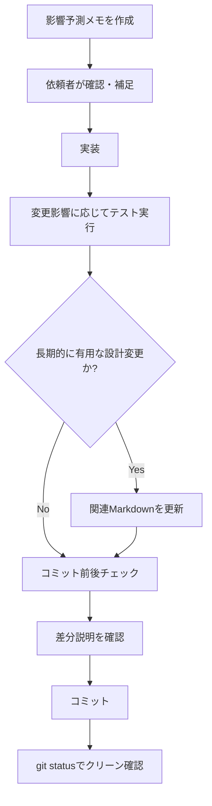

# 進め方の指針（事故を減らすための流れ）

## 目的
機能追加時の意図のズレや、実装と資料の不一致を最小化する。

## 基本フロー（軽量）
1. **影響予測メモを作成**（1ページ程度）
   - 対象機能
   - 既存の関連箇所（関数/状態/画面）
   - 変わる挙動 / 変わらない挙動
   - 想定される齟齬ポイント
2. **依頼者が確認・補足**
   - OK / NG / 補足のフィードバック
3. **実装**
   - 影響予測メモに沿って実装
4. **テスト実行**
   - 変更影響に応じたテストを実行
   - 既存テストを回すだけでなく、バグ修正や仕様追加に対応する回帰テストを必要に応じて追加
   - 初回または `node_modules` がない環境では、README.md の開発者向け準備に従い
     `npm install` を実行してから検証する。
   - JavaScript 変更時の基本コマンド:
     - `npm run lint`
     - `node --test tests/*.mjs`
   - YouTube 再生やサイドバー操作などブラウザ上の回帰に関わる変更では、
     `npm run test:e2e` も実行する。
5. **必要なら DESIGN.md / README.md / AGENTS.md 等へ反映**
   - 合意した設計が長期的に有用な場合のみ追記
   - 次の変更は原則ドキュメント追記対象:
     - ユーザー操作（UI導線/表示条件）が変わる
     - 状態の永続化仕様（保存対象・保存タイミング）が変わる
     - データ取得/キャッシュ方式（JSON/CSV/IndexedDBなど）が変わる
     - GitHub Actions / Pages deploy / 生成物更新フローが変わる
     - テスト観点として運用上重要な回帰ケースを追加した
6. **コミット前後チェック**
   - ステージング差分を「追加機能 / 問題点」で説明できる状態にする
   - コミットメッセージは既存慣例に合わせる（件名 + 本文、日本語説明を含める）
   - コミット後に `git status` でワークツリーがクリーンであることを確認

## 例（今回の齟齬を想定した項目）
- おすすめの並びを「条件復帰時に維持するか」
- キャッシュを破棄するタイミング
- データ取得元やキャッシュ鮮度確認の責務
- 自動生成ファイルと Pages deploy の更新タイミング
- UIの表示テキストの切替条件
- 操作方向の対称性（例: 左→右と右→左の並び替え）
- モード別UI表示の条件（例: ブックマーク表示時のみハンドル表示）
- 画面上の並び替え結果を保存仕様に反映するか

## 補足
- 影響予測メモは「未来の自分への説明書」として最小限で良い。
- 追加前に前提を揃えることが最大の効果。

## 広範囲リファクタリング時の補足フロー

### ディレクトリ再編 / import 更新
1. **移動方針を先に固定**
   - どのディレクトリへ何を移すかを決めてから着手する
   - `controllers` `ui` `lib` のように浅い構成を優先する
2. **ファイル移動と参照更新を分離**
   - 先にファイルを移動
   - 次に `import` `export ... from` `script src` `link href` を更新
   - 2つを一度に雑に触らない
3. **段階的に検証**
   - 変更したファイル群へ `node --check <file>` を段階的に実行
   - 残存参照は `rg` で確認
   - 最後に `npm run lint` と `node --test tests/*.mjs`
   - ブラウザ操作や YouTube smoke に影響する場合は `npm run test:e2e`

### 置換作業の注意
- PowerShell の一括文字列置換や広い正規表現置換は、
  `import` や識別子、プロパティアクセス、HTML タグ名を壊すことがある。
- 置換が必要でも、まずは対象を `rg` で列挙し、
  ファイル単位か小さなまとまりで適用する。
- 置換後は、壊れやすいファイルを優先して目視確認する。
  例:
  `index.html`
  エントリーポイントの `app/bootstrap.mjs`
  import を多く持つコントローラー
  テストの先頭 import 群

### 事故が起きたとき
- 破損が疑われる場合は、そのまま置換を続けず、まず正常なファイルへ戻す。
- 構文エラーが出たファイルと、文字化けや記号破損が見えるファイルを優先して修復する。
- 修復後に再度 `node --check` と `node --test tests/*.mjs` を実行し、
  回帰がないことを確認する。
