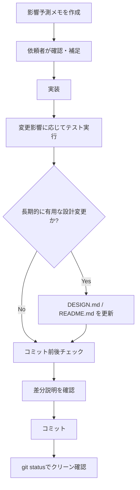

# 進め方の指針（事故を減らすための流れ）

## 目的
機能追加時の意図のズレや、実装と資料の不一致を最小化する。

## 基本フロー（軽量）
1. **影響予測メモを作成**（1ページ程度）
   - 対象機能
   - 既存の関連箇所（関数/状態/画面）
   - 変わる挙動 / 変わらない挙動
   - 想定される齟齬ポイント
2. **依頼者が確認・補足**
   - OK / NG / 補足のフィードバック
3. **実装**
   - 影響予測メモに沿って実装
4. **テスト実行**
   - 変更影響に応じたテストを実行
   - 既存テストを回すだけでなく、バグ修正や仕様追加に対応する回帰テストを必要に応じて追加
   - 現在の基本コマンド: `node --test tests/*.mjs`
5. **必要なら DESIGN.md / README.md へ反映**
   - 合意した設計が長期的に有用な場合のみ追記
   - 次の変更は原則ドキュメント追記対象:
     - ユーザー操作（UI導線/表示条件）が変わる
     - 状態の永続化仕様（保存対象・保存タイミング）が変わる
     - テスト観点として運用上重要な回帰ケースを追加した
6. **コミット前後チェック**
   - ステージング差分を「追加機能 / 問題点」で説明できる状態にする
   - コミットメッセージは既存慣例に合わせる（件名 + 本文、日本語説明を含める）
   - コミット後に `git status` でワークツリーがクリーンであることを確認

## 例（今回の齟齬を想定した項目）
- おすすめの並びを「条件復帰時に維持するか」
- キャッシュを破棄するタイミング
- UIの表示テキストの切替条件
- 操作方向の対称性（例: 左→右と右→左の並び替え）
- モード別UI表示の条件（例: ブックマーク表示時のみハンドル表示）
- 画面上の並び替え結果を保存仕様に反映するか

## 補足
- 影響予測メモは「未来の自分への説明書」として最小限で良い。
- 追加前に前提を揃えることが最大の効果。
